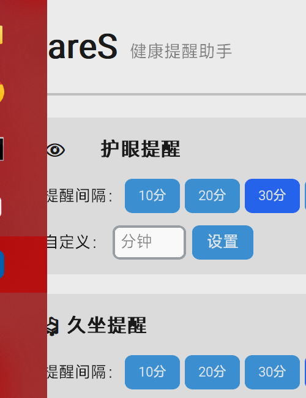

# CareS - 健康提醒助手

一个轻量级的护眼/久坐/喝水提醒程序，带内存清理功能。

## 界面预览



## 功能

- 👁️ **护眼提醒** - 定时提醒休息眼睛
- 🪑 **久坐提醒** - 定时提醒起来活动
- 💧 **喝水提醒** - 定时提醒喝水
- 🧹 **内存清理** - 一键清理系统内存（类似 memreduct）
- 🔔 **进度条弹窗** - 右下角带进度条的提醒弹窗
- 📌 **托盘常驻** - 关闭窗口后最小化到托盘

## 下载

### 直接下载 exe（推荐）

👉 [点击下载 CareS.exe](../../releases/latest)

无需安装 Python，双击即可运行。

### 从源码运行

```bash
# 克隆仓库
git clone https://github.com/JunioreXu/CareS.git
cd CareS

# 安装依赖
pip install -r requirements.txt

# 运行
python main.py
```

### 打包成 exe

```bash
# 方式1：运行打包脚本
build.bat

# 方式2：手动打包
pip install pyinstaller
pyinstaller --onefile --windowed --name "CareS" --exclude-module numpy main.py
```

打包完成后，exe 文件在 `dist/CareS.exe`。

## 使用说明

### 提醒设置
- 每个提醒可以独立开关
- 间隔时间支持快捷选择（10-60分钟）
- 支持自定义输入（1-60分钟）
- 提醒次数可选：无限、1-10次
- **点击设置时间后自动开启提醒**

### 内存清理
- 需要**以管理员身份运行**才能清理系统内存
- 使用 Windows Native API（和 memreduct 相同方式）
- 清理项：工作集、待机列表、修改页面、文件缓存

### 托盘功能
- 左键点击托盘图标：显示主窗口
- 右键托盘图标：显示菜单（清理内存、退出）
- 托盘图标显示最近提醒的倒计时分钟数

## 系统要求

- Windows 7/8/10/11
- Python 3.8+（仅源码运行需要）

## 技术栈

- **UI 框架**: customtkinter
- **系统托盘**: pystray
- **内存清理**: Windows Native API (ntdll.dll)
- **打包工具**: PyInstaller

## 许可证

MIT License
